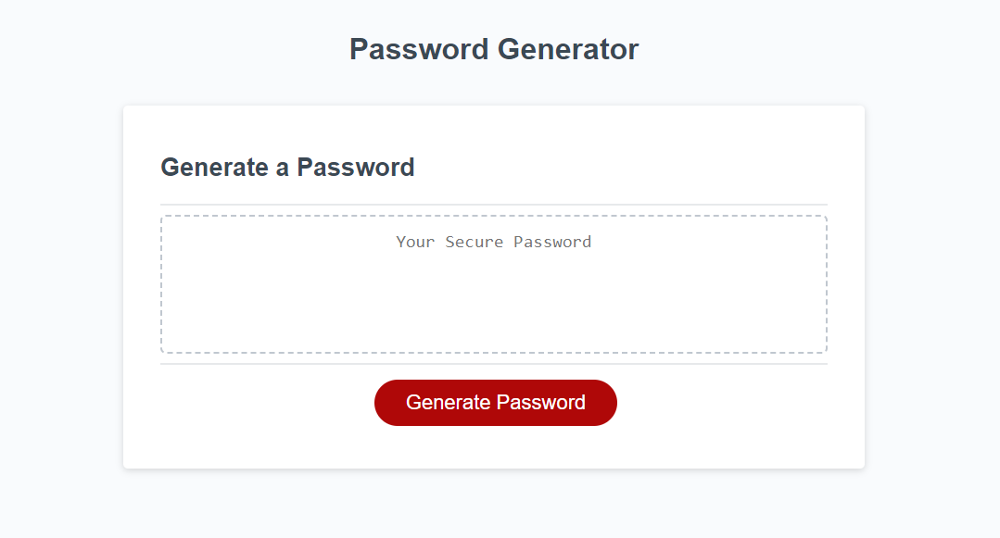
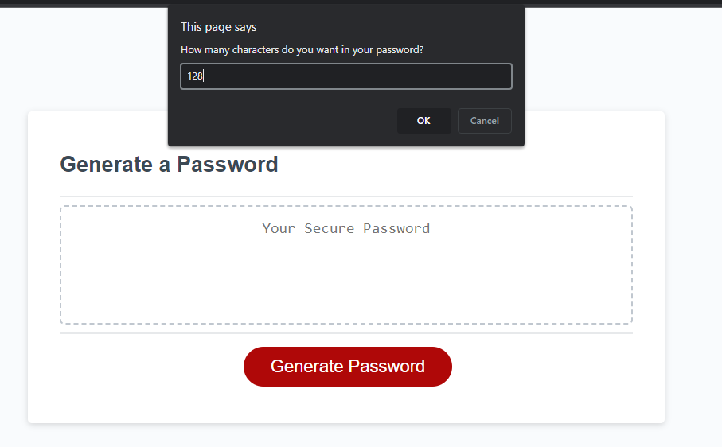
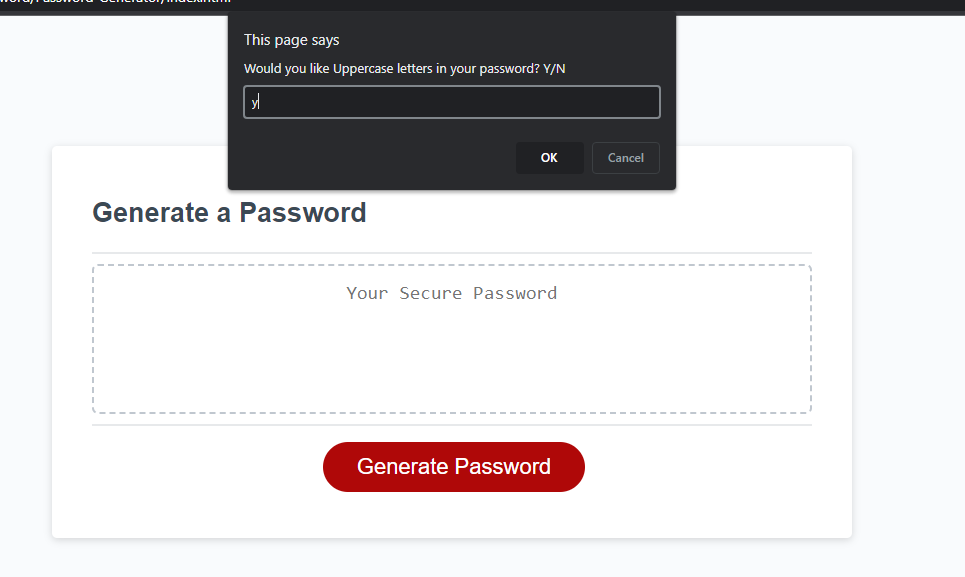
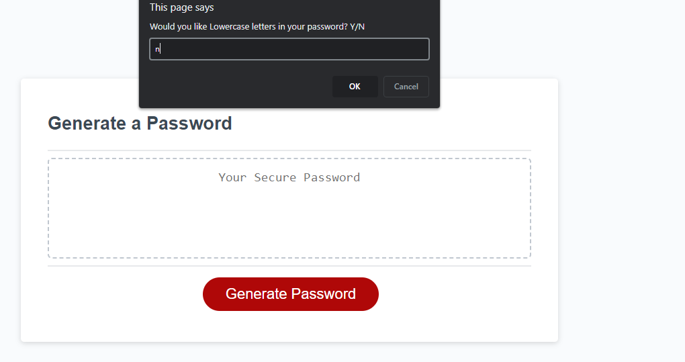
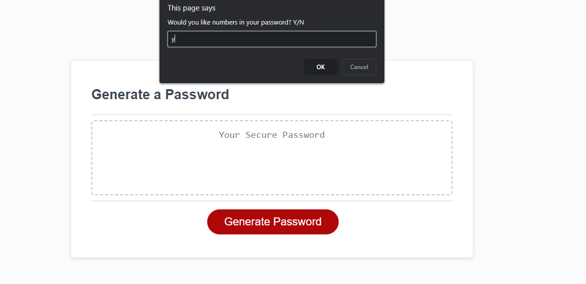
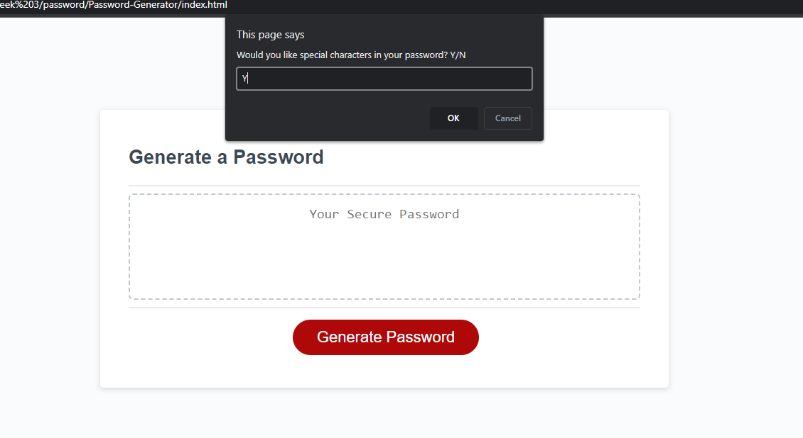
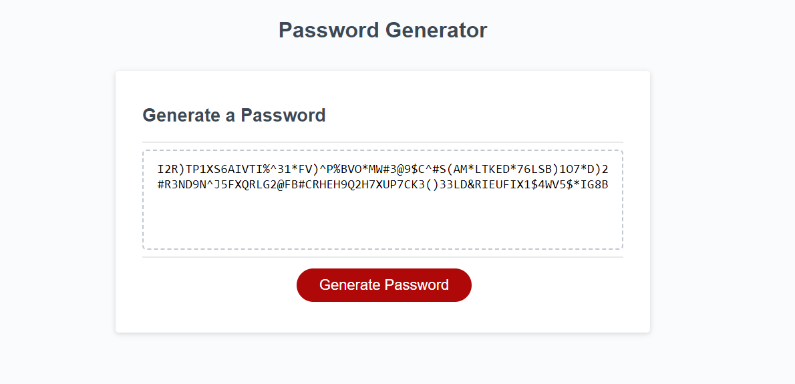

# Password-Generator
Random Password Generator

The goal of the RPG is to make a random password after prompting the user.
The prompts are the following

Q1 How many characters do you want in your password?
    if the user selects a number outside of the range 8-128 they will be asked to input a number inside of that range
    If the user does not select a number they will be asked the same question.

Q2 Do you want UpperCase letters?

Q3 Do you want LowerCase letters?

Q4 Do you want Numbers?

Q5 Do you want Special Characters?
    For Q2-Q5 if the user does not select a Y/N it will reprompt them.

At the end it will display the final password.

